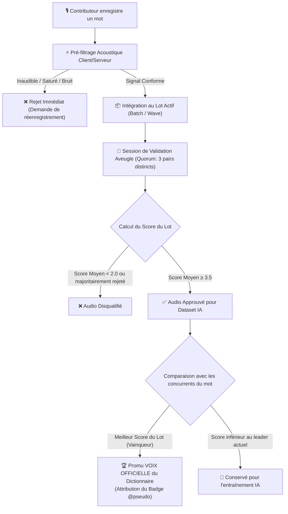

# Corafric — Algorithme de Validation Dynamique par Lots & Élection de la Voix Officielle
*Document d'Architecture Technique, Spécifications Algorithmiques & Vision Produit*

---

## 1. Vision & Problématique

Dans les systèmes traditionnels de collecte participative (crowdsourcing), les enregistrements s'accumulent souvent dans des files d'attente infinies sans garantie de convergence rapide. De plus, une langue à tons comme l'**Éwé (Eʋegbe)** exige une rigueur acoustique et tonale absolue : un mot mal accentué change totalement de sens.

Pour résoudre ce défi, Corafric implémente un **Algorithme de Validation Dynamique par Lots (Tournament Batch Algorithm)**, combinant :
1. Un **filtrage acoustique automatique** côté client & serveur.
2. Un **système de validation par vagues (epochs)** où les audios concurrents pour un même mot sont confrontés.
3. L'élection automatique du **« Vainqueur du Lot »** promu au rang de **Voix Officielle du Dictionnaire**.
4. L'exportation des audios d'excellence vers le **dataset d'entraînement du modèle Text-to-Speech (TTS) / IA**.

---

## 2. Le Cycle de Vie d'un Enregistrement



---

## 3. Détail des Étapes de l'Algorithme

### Étape 1 : Le Pré-filtrage Acoustique (Signal Gate)
Avant même d'être soumis aux votants, l'enregistrement passe par des contrôles de conformité :
- **Seuil d'énergie minimale (RMS)** : Rejet si l'audio est silencieux ou trop faible.
- **Détection de saturation (Clipping)** : Rejet si le gain micro sature la piste.
- **Durée minimale & maximale** :
  - Dictionnaire (mots isolés) : $0.4\text{ s} \le \text{durée} \le 4.0\text{ s}$
  - Corpus textuel (phrases) : $1.0\text{ s} \le \text{durée} \le 18.0\text{ s}$

---

### Étape 2 : La Gestion Dynamique par Lots (Batching & Priorité)
Le système ne distribue pas les validations au hasard. Il applique un algorithme de **priorisation adaptative** :

1. **Quorum d'évaluation ($Q = 3$)** :
   Chaque enregistrement doit recevoir au moins **3 avis indépendants** d'utilisateurs distincts.
2. **Priorité aux lots presque clos** :
   Un mot ayant déjà 2 votes passe en priorité absolue sur la file de validation pour être clôturé rapidement plutôt que d'éparpiller les votes sur 500 mots différents.
3. **Isolation de l'auteur (Anti-fraude)** :
   L'auteur d'un enregistrement ne reçoit jamais ses propres enregistrements dans sa file d'évaluation ($\text{user\_id} \ne \text{author\_id}$).

---

### Étape 3 : La Formule de Notation & Critères de Décision

Chaque évaluateur attribue une note $s_i \in \{1, 2, 3, 4, 5\}$ basée sur :
- **La netteté** (absence d'écho et de bruits parasites).
- **L'exactitude des tons Éwé** (ton haut, ton bas, ton moyen).

#### Calcul du Score Moyen Pondéré :
$$\bar{S} = \frac{1}{N} \sum_{i=1}^{N} s_i \quad (N \ge 3)$$

#### Règles de Décision :

| Score Obtenu ($\bar{S}$) | Statut | Destination |
| :--- | :--- | :--- |
| $\bar{S} < 2.0$ ou $V_{\text{rejet}} > \frac{N}{2}$ | **`rejected`** | Écarté du corpus. |
| $2.0 \le \bar{S} < 3.5$ | **`pending_review`** | Lot étendu nécessitant des votes supplémentaires. |
| $\bar{S} \ge 3.5$ | **`approved`** | Qualifié pour l'entraînement de l'Intelligence Artificielle. |

---

### Étape 4 : L'Élection du Vainqueur et de la « Voix Officielle »

Pour chaque mot du dictionnaire :
1. Parmi tous les enregistrements `approved` pour ce mot, celui qui possède le **score moyen $\bar{S}$ le plus élevé** reçoit l'attribut `is_best_for_word = TRUE`.
2. L'URL audio de cet enregistrement est directement liée au mot dans la table `dictionary_words`.
3. Le dictionnaire public affiche le badge d'honneur : **« Voix : @NomDuContributeur »**.
4. En cas d'égalité parfaite de note, l'enregistrement ayant le plus grand nombre d'avis favorables ou le plus ancien est désigné vainqueur.

---

## 4. Pourquoi ce Système est Puissant pour le Projet

```
┌─────────────────────────────────────────────────────────────────────────┐
│                       LES 4 BÉNÉFICES STRATÉGIQUES                      │
├─────────────────────────────────────────────────────────────────────────┤
│ 1. Émulation Communautaire : Les contributeurs cherchent à avoir leur   │
│    nom affiché sur le plus grand nombre de mots du dictionnaire.        │
│                                                                         │
│ 2. Zéro Déchet : Même les enregistrements arrivés 2e ou 3e (score ≥ 3.5)│
│    enrichissent le dataset d'entraînement IA (multi-locuteurs).         │
│                                                                         │
│ 3. Clôture Rapide des Lots : Grâce à la priorisation des mots à 2 votes,│
│    les validations se finalisent en quelques heures au lieu de mois.    │
│                                                                         │
│ 4. Transparence Totale : Les critères sont audités, publics et compris  │
│    par toute la communauté et les partenaires institutionnels.          │
└─────────────────────────────────────────────────────────────────────────┘
```

---

## 5. Guide de Présentation pour l'Équipe & Réunions

Pour expliquer le projet à un collaborateur, partenaire ou investisseur en 1 minute :

> *"Sur Corafric, nous ne faisons pas de la collecte audio passive. Nous organisons une élection participative de la voix de la nation. Chaque mot est mis en compétition dans un lot. Trois locuteurs notent la prononciation et les tons en aveugle. L'enregistrement vainqueur devient la voix officielle du dictionnaire avec le nom du contributeur, et l'ensemble des audios validés entraîne notre modèle d'intelligence artificielle souveraine."*
